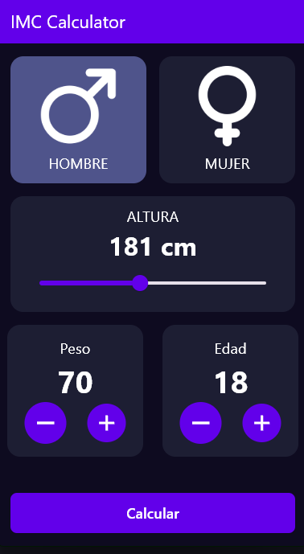

# 🏋️ IMC Calculator (Calculadora de Índice de Masa Corporal)

Una aplicación móvil moderna y funcional para calcular el Índice de Masa Corporal (IMC), desarrollada con Flutter.

Este proyecto ofrece una interfaz de usuario limpia e intuitiva, permitiendo a los usuarios ingresar su peso, altura y edad de forma sencilla para obtener su resultado de IMC.

## ✨ Características

- **Cálculo de IMC:** Determina el Índice de Masa Corporal basándose en datos de usuario.
- **Interfaz Intuitiva:** Diseño limpio y fácil de usar para ingresar datos (Altura, Peso, Edad, Género).
- **Controladores de Valor:** Sliders para altura y botones (+/-) para peso y edad.
- **Pantalla de Resultados:** Muestra un resumen de los datos ingresados y el resultado del cálculo.
- **Temática Oscura:** Diseño basado en una paleta de colores oscuros para una experiencia visual agradable.

## 📸 Capturas de Pantalla

| Pantalla Principal (Entrada de Datos) | Pantalla de Resultados |
| :---: | :---: |
|  |  |

## 🛠️ Tecnologías Utilizadas

- **Flutter:** Framework de UI para el desarrollo.
- **Dart:** Lenguaje de programación.
- **Material Design:** Para la interfaz de usuario.

## 🚀 Cómo ejecutar el proyecto localmente

Asegúrate de tener instalado Flutter y Dart en tu máquina.

1.  **Clona el repositorio:**
    ```bash
    git clone [https://github.com/tu-usuario/nombre-del-repo.git](https://github.com/tu-usuario/nombre-del-repo.git)
    cd nombre-del-repo
    ```

2.  **Instala las dependencias:**
    ```bash
    flutter pub get
    ```

3.  **Ejecuta la aplicación:**
    ```bash
    flutter run
    ```

## 📝 Licencia

Este proyecto está bajo la Licencia MIT.